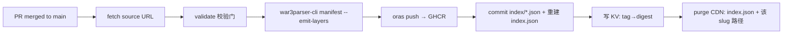

# war3parser 地图分发系统设计

**存储后端**:GitHub Packages（GHCR，OCI artifact）
**分发层**:Cloudflare Workers + CDN
**索引**:Git 仓库（纯文本，无二进制）

> **文档分两部分。**
> §0–§11 是 **v1(人工 PR)**:贡献者手写 TOML、开 PR、等 review。
> §12–§15 是 **v2(自助发布)**:客户端直传 → Worker 代开 PR → 校验通过自动合并 → Action 发布。
> **PR 没有消失,只是不再由人来写、也不再默认由人来批。** git 历史仍是信任根。
> manifest schema、digest 校验、CDN 路由在两版之间完全复用。

---

## 0. 目标与非目标

### 目标

| # | 目标 | 验收标准 |
|---|---|---|
| G1 | 地图本体不进 git | 索引仓库 `git clone` 永远 < 50 MB |
| G2 | 元数据 100% 机器生成 | 贡献者只提交 URL + sha256,其余由 `war3parser` 解析产出 |
| G3 | 内容寻址、可验证 | 每次下载流式校验 sha256,不匹配即丢弃 |
| G4 | 存储层可替换 | 换后端只改 Worker 里一个 origin 常量,客户端零改动 |
| G5 | 浏览器可直接消费 | playground 能不经后端直接列图、看缩略图、下载 |
| G6 | 稳态成本 ≈ $0 | 除域名外无固定支出 |

### 非目标

- 不做用户账号体系(鉴权全部借 GitHub)
- 不做地图评分/评论/社交(索引仓库的 Issue 就够)
- 不做私有/付费地图(全部公开,否则 GHCR 免费额度不成立)
- v1 不做 BT/P2P

---

## 1. 总体架构

```
                 ┌──────────────────────────────────────────┐
   贡献者 ──PR──▶│  war3maps-index  (GitHub Repo)           │
                 │  sources/<ns>/<name>/<ver>.toml  ← 人写   │
                 │  index/<ns>/<name>/<ver>.json    ← 机生成 │
                 │  index.json                      ← 机生成 │
                 └───────────────┬──────────────────────────┘
                                 │ GitHub Actions
                    ┌────────────┴─────────────┐
                    │  ingest.yml              │
                    │  1. fetch  源 URL         │
                    │  2. verify sha256/大小     │
                    │  3. parse  war3parser-cli │
                    │  4. push   oras → GHCR    │
                    │  5. commit 索引回仓库       │
                    │  6. warm   KV + CDN purge │
                    └────────────┬─────────────┘
                                 │
              ┌──────────────────▼───────────────────┐
              │  ghcr.io/<org>/w3map/<ns>/<name>     │  ← 真正的字节
              │  :6.83d  → OCI manifest              │
              │           ├ config  manifest.json    │
              │           ├ layer0  map.w3x          │
              │           ├ layer1  minimap.png      │
              │           └ layer2  snapshot.json.zst│
              └──────────────────┬───────────────────┘
                                 │ 匿名 pull (token broker)
              ┌──────────────────▼───────────────────┐
              │  Cloudflare Worker  cdn.w3maps.dev   │
              │  · tag→digest 走 KV,不打 GHCR 热路径  │
              │  · /v1/blobs/* 边缘永久缓存 immutable │
              │  · 注入 CORS,支持 Range              │
              └──────────────────┬───────────────────┘
                                 │
                 ┌───────────────┴────────────────┐
                 ▼                                ▼
        w3pkg CLI (Rust)                 playground (WASM)
        install / search / update        列表 · 缩略图 · 在线解析
```

**一句话**:GHCR 存字节,Git 存索引,Worker 把两者拼成一个干净的公开 HTTP API。

---

## 2. 数据模型

### 2.1 命名与坐标

```
slug     = <namespace>/<name>          例:dota/allstars, melee/turtle-rock
version  = 自由字符串,建议 semver-ish  例:6.83d, 1.24e, 2026-03-01
coord    = <slug>@<version>            例:dota/allstars@6.83d
```

- `namespace` / `name` 正则:`^[a-z0-9][a-z0-9-]{0,38}[a-z0-9]$`
- OCI 仓库名:`ghcr.io/<org>/w3map/<namespace>/<name>`,tag 即 `version`
- 权威标识始终是 **digest**;tag 只是人类可读的别名

### 2.2 OCI artifact 布局

一张地图 = 一个 OCI manifest,三层:

```jsonc
{
  "schemaVersion": 2,
  "mediaType": "application/vnd.oci.image.manifest.v1+json",
  "artifactType": "application/vnd.war3.map.v1+json",
  "config": {
    "mediaType": "application/vnd.war3.map.config.v1+json",
    "digest": "sha256:3a1f…",           // 就是 §2.3 的 manifest JSON
    "size": 2841
  },
  "layers": [
    {
      "mediaType": "application/vnd.war3.map.w3x",
      "digest": "sha256:9f2c…",          // ← 客户端真正要的字节
      "size": 8123456,
      "annotations": { "org.opencontainers.image.title": "DotA_Allstars_6.83d.w3x" }
    },
    {
      "mediaType": "image/png",
      "digest": "sha256:c07d…",          // 128×128 minimap,给列表页用
      "size": 41233,
      "annotations": { "org.opencontainers.image.title": "minimap.png" }
    },
    {
      "mediaType": "application/vnd.war3.map.snapshot.v1+json+zstd",
      "digest": "sha256:5be8…",          // 完整 MapSnapshot,含 wts/imp/listfile
      "size": 92841,
      "annotations": { "org.opencontainers.image.title": "snapshot.json.zst" }
    }
  ],
  "annotations": {
    "org.opencontainers.image.title": "DotA Allstars v6.83d",
    "org.opencontainers.image.authors": "IceFrog",
    "org.opencontainers.image.created": "2026-08-05T00:00:00Z",
    "org.opencontainers.image.source": "https://github.com/<org>/war3maps-index",
    "dev.war3.slug": "dota/allstars",
    "dev.war3.version": "6.83d",
    "dev.war3.w3i-version": "25",
    "dev.war3.players": "10"
  }
}
```

**分层的意义**:列表页只拉 layer1(40 KB),详情页拉 config(3 KB),只有点了下载才拉 layer0(8 MB)。三者独立寻址、独立缓存。

> ⚠️ GHCR 对自定义 `artifactType` 的支持需在接入时实测一次。若被拒,fallback 是把类型写进 `config.mediaType` 并省略顶层 `artifactType`——这是 OCI 1.0 时代的通行做法,ORAS 默认就这么干,不影响本设计任何其他部分。

### 2.3 Manifest schema（`war3parser` 产出的唯一真相）

```rust
// crates/core/src/model/manifest.rs  （新增）
pub struct MapManifest {
    pub schema: u32,                    // 1
    pub slug: String,                   // "dota/allstars"
    pub version: String,                // "6.83d"
    pub digest: String,                 // "sha256:9f2c…"  (.w3x 原始字节)
    pub size: u64,
    pub filename: String,               // 上游原始文件名
    pub info: MapInfoSummary,
    pub assets: MapAssets,
    pub provenance: Provenance,
}

pub struct MapInfoSummary {             // 全部来自 War3MapW3i / War3MapHeader
    pub name: String,                   // TRIGSTR 已解析
    pub author: String,
    pub description: String,
    pub recommended_players: String,
    pub w3i_version: u32,               // FormatVersion.0  → 8..=33
    pub editor_version: Option<u32>,
    pub build_version: Option<[u32; 4]>,
    pub tileset: char,                  // w3i.tileset as char
    pub playable_size: [i32; 2],
    pub user_slots: u8,                 // players.filter(player_type == 1).count()
    pub total_slots: u8,                // players.len()
    pub forces: u8,
    pub script: Script,                 // Jass | Lua      (w3i.script_mode, v28+)
    pub graphics: Graphics,             // Sd | Hd | Both  (w3i.graphics_mode, v31+)
    pub melee: bool,                    // w3i.flags bit
    pub protected: bool,                // 见下方判定
    pub imports: u32,                   // imp.entries_sorted().len()
    pub has_minimap: bool,
}

pub struct MapAssets {                  // 各 layer 的 digest,供 Worker 直接寻址
    pub w3x: BlobRef,
    pub minimap: Option<BlobRef>,
    pub snapshot: Option<BlobRef>,
}

pub struct Provenance {
    pub source_url: String,             // 提交时声明的原始下载地址
    pub submitted_by: String,           // GitHub 用户名(由 CI 从 PR 填入)
    pub submitted_at: String,           // RFC3339
    pub parser_version: String,         // env!("CARGO_PKG_VERSION")
}
```

`protected` 判定(三者任一为真):`!header.has_hm3w` ∨ `w3i.skipped_optional_sections` ∨ `files.is_none()`(无 listfile)。

**确定性要求**:`MapManifest` 必须能从 `.w3x` 字节 + `Provenance` 完全复现。这让 CI 可以在任意时刻重跑并比对——`MapSnapshot.parse_ms` 在原生构建下恒为 `None`,天然满足;新增字段时必须保持这条性质。

---

## 3. 上传流程

### 3.1 提交格式（贡献者唯一需要写的东西）

`sources/dota/allstars/6.83d.toml`:

```toml
url    = "https://github.com/someone/dota-archive/releases/download/v6.83d/DotA_Allstars_6.83d.w3x"
sha256 = "9f2c4a…"                       # 必填,防中间人 & 锁定内容
license = "custom-community"             # 见 §9
notes  = "作者主页存档,已获 IceFrog 社区镜像许可"
```

只有 4 个字段,其中 3 个是一行。**地图名、作者、人数、版本全都不用填**——填了也会被 CI 解析结果覆盖。

### 3.2 三条上传通道

| 通道 | 适用 | 权限 |
|---|---|---|
| **A. PR**(主) | 社区投稿 | 任何人;维护者 review 后合并触发发布 |
| **B. Issue Form** | 不会用 git 的人 | 机器人把 issue 转成 PR |
| **C. `w3pkg publish`** | 地图作者自助 | GitHub OIDC / PAT,直推 GHCR + 自动开 PR |

三条通道最终都汇聚到同一个 `ingest.yml`,不存在绕过校验的旁路。

### 3.3 为什么不直接把 `.w3x` 传进 PR

- git 单文件硬限 100 MiB,且二进制永久留在 history 里,仓库只增不减
- PR diff 无法 review 二进制
- 走 URL + sha256 后,索引仓库十年后仍然只有几十 MB

这正是 Homebrew 的做法:formula 里只有 `url` + `sha256`。

---

## 4. 解析与校验（war3parser 的核心位置）

### 4.1 新增 CLI 子命令

```bash
# 产出 manifest（stdout 或文件）
war3parser-cli manifest map.w3x \
    --slug dota/allstars --version 6.83d \
    --source-url https://… --submitted-by wesleyel \
    --format json --out manifest.json

# 同时把 OCI push 需要的三个 layer 落到目录
war3parser-cli manifest map.w3x … --emit-layers ./oci/
#   ./oci/manifest.json     ← config blob
#   ./oci/map.w3x           ← 硬链接/拷贝
#   ./oci/minimap.png       ← 从 read_minimap() 转 PNG
#   ./oci/snapshot.json.zst ← MapSnapshot 全量

# 纯校验,给 CI 用,退出码即结论
war3parser-cli validate map.w3x --expect-sha256 9f2c… --max-size 268435456
```

实现上是 `War3MapMetadata::parse` → `resolve_trigger_strings` → `snapshot()` 的一层薄封装,复用已有全部能力,不碰解析逻辑。

### 4.2 CI 校验门（`ingest.yml` job `validate`）

| 门 | 规则 | 失败处理 |
|---|---|---|
| 大小 | ≤ 256 MB | 拒绝 |
| 完整性 | 下载后 sha256 == 声明值 | 拒绝,提示可能是上游变更 |
| 归档 | `War3MapW3x::from_buffer` 成功 | 拒绝 |
| w3i | 解析成功且 `version ∈ [8, 40]` | 拒绝;>33 走人工 review(新版本格式) |
| 命名 | slug/version 匹配正则且路径与文件名一致 | 拒绝 |
| 去重 | 该 digest 未在索引中出现过 | 拒绝并指出已存在的坐标 |
| 版本冲突 | `slug@version` 未被占用 | 拒绝(版本不可变,要改就发新版本) |
| 可疑导入 | `imp` 中无 `.exe/.dll/.bat/.scr` 等扩展名 | 标记,转人工 review |
| 元数据健全 | `name` 非空;`user_slots ∈ [1, 24]` | 警告,不阻断(保护图很常见) |

**保护图必须放行**——DotA 这类图 `skipped_optional_sections = true`、无 listfile,恰恰是最需要收录的。`protected` 只作为 manifest 上的一个标记,不是拒绝理由。

### 4.3 解析结果直接进 PR

CI 把生成的 manifest 渲染成 Markdown 表格 + minimap 图片回帖到 PR:

```
✅ dota/allstars@6.83d
   DotA Allstars v6.83d — IceFrog
   10 人 · Lordaeron Summer · 224×224 · w3i v25 · JASS · 受保护
   8.12 MB · sha256:9f2c…
   [minimap 缩略图]
```

Review 变成"看一眼这张图对不对",而不是"核对填写的元数据"。

---

## 5. 发布流程（CI）



### 5.1 推送

```bash
oras push ghcr.io/$ORG/w3map/dota/allstars:6.83d \
  --artifact-type application/vnd.war3.map.v1+json \
  --config oci/manifest.json:application/vnd.war3.map.config.v1+json \
  --annotation-file oci/annotations.json \
  oci/map.w3x:application/vnd.war3.map.w3x \
  oci/minimap.png:image/png \
  oci/snapshot.json.zst:application/vnd.war3.map.snapshot.v1+json+zstd
```

认证用 workflow 自带的 `GITHUB_TOKEN`(`packages: write`),无需长期 secret。首次推送后需把 package 手动设为 public(或用 API 设置),之后同 repo 的新 package 继承可见性。

### 5.2 索引回写

CI 把 `manifest.json` 写入 `index/dota/allstars/6.83d.json`,再重建两个聚合文件:

- `index.json` —— 全量精简索引,**只含列表页需要的字段**(slug/version/name/author/slots/tileset/size/digest/minimap-digest)。1 万张图约 2.5 MB,gzip 后约 400 KB。
- `index.ndjson.zst` —— 同内容的流式版本,给 CLI 增量解析用,约 250 KB。

完整 manifest 永远按需单取,不进聚合索引。

### 5.3 关键设计:CI 主动写 KV

发布的最后一步是把 `tag → digest` 映射 **PUT 进 Workers KV**。这样 Worker 的热路径永远不需要向 GHCR 查询 tag:

```
KV: "tag:dota/allstars:6.83d" → { "w3x": "sha256:9f2c…", "minimap": "sha256:c07d…", … }
```

意义:GHCR 只在**边缘缓存未命中的 blob 拉取**时被访问一次。tag 解析、列表、搜索全部零 GHCR 流量,彻底规避 registry 的速率限制。

---

## 6. 分发层（Cloudflare Worker）

### 6.1 为什么必须有这一层

GHCR 直连给客户端有五个硬伤:

1. **无 CORS** —— 浏览器/playground 根本没法直接 fetch
2. **匿名 pull 要 token 舞** —— 先 `GET /token?scope=…` 再带 Bearer,多一个 RTT 且逻辑要在每个客户端重复实现
3. **blob 是 307 到签名 URL** —— 签名会过期,不可缓存、不可分享
4. **URL 不可读** —— `ghcr.io/v2/org/w3map/dota/allstars/blobs/sha256:9f2c…`
5. **无速率控制** —— 一次爬虫就可能把 registry 配额打满

Worker 把这五个问题一次性解决,并且成为 §0-G4 的"可替换点"。

### 6.2 路由表

| 路由 | 返回 | Cache-Control |
|---|---|---|
| `GET /v1/index.json` | 全量精简索引 | `max-age=60, s-maxage=300` + ETag |
| `GET /v1/index.ndjson.zst` | 同上,流式 | 同上 |
| `GET /v1/maps/{ns}/{name}` | 该图全部版本列表 | `max-age=300, s-maxage=86400` |
| `GET /v1/maps/{ns}/{name}/{ver}` | 完整 MapManifest | `max-age=300, s-maxage=86400` |
| `GET /v1/maps/{ns}/{name}/{ver}/map.w3x` | 302 → `/v1/blobs/{digest}` | `max-age=300` |
| `GET /v1/maps/{ns}/{name}/{ver}/minimap.png` | 302 → blob | `max-age=300` |
| `GET /v1/blobs/{digest}` | **原始字节** | `max-age=31536000, immutable` |
| `GET /v1/健康检查 /v1/status` | 版本 + KV 条目数 | `no-store` |

**核心是最后两行的分离**:带版本号的 URL 是可变的(会被 purge),带 digest 的 URL 是不可变的(永久缓存)。客户端拿到 302 后缓存 digest URL,后续升级只需要重新解析一次 tag。

### 6.3 blob 取回逻辑

```js
// 伪代码
async function getBlob(digest, env, ctx) {
  const cacheKey = new Request(`https://cdn/v1/blobs/${digest}`);
  const hit = await caches.default.match(cacheKey);
  if (hit) return hit;                                  // 边缘命中,不碰 GHCR

  const token = await anonToken(env);                   // Cache API 缓存 ~4 min
  const upstream = await fetch(
    `https://ghcr.io/v2/${env.NS}/blobs/${digest}`,
    { headers: { Authorization: `Bearer ${token}` }, redirect: "follow" }
  );

  const res = new Response(upstream.body, {
    headers: {
      "Content-Type": "application/octet-stream",
      "Cache-Control": "public, max-age=31536000, immutable",
      "Access-Control-Allow-Origin": "*",
      "X-Content-Digest": digest,
      "Accept-Ranges": "bytes",
    },
  });
  ctx.waitUntil(caches.default.put(cacheKey, res.clone()));
  return res;
}
```

匿名 token:`GET https://ghcr.io/token?service=ghcr.io&scope=repository:<owner>/<name>:pull` → `{ "token": "…" }`,有效期 5 分钟,在 Worker 里按 scope 缓存 4 分钟。公开 package 无需任何凭据。

### 6.4 缓存失效

- blob:**永不失效**(内容寻址,内容变了 URL 就变了)
- `index.json` / `maps/*`:CI 发布后调 Cloudflare purge API 精确清除受影响路径
- 兜底:`s-maxage` 最长 24 h,即使 purge 失败也会自愈

### 6.5 自定义域名

`cdn.w3maps.dev` 挂 Worker route。CDN 与 GHCR 之间的关系被完全封装,客户端只认这个域名。

---

## 7. 客户端

### 7.1 `w3pkg` CLI

```bash
w3pkg search dota                    # 本地索引全文搜索,零网络(索引已缓存)
w3pkg info dota/allstars@6.83d       # 拉 manifest,渲染详情
w3pkg install dota/allstars          # 装最新版
w3pkg install dota/allstars@6.83d    # 装指定版
w3pkg update                         # 刷新索引(ETag,通常 304)
w3pkg list                           # 已装列表
w3pkg verify                         # 重算本地图 sha256,对照 lockfile
```

安装路径自动探测 `Warcraft III/Maps/Download/`(macOS / Windows / Wine 三套默认位置,`--map-dir` 覆盖)。

### 7.2 安装时序

```
1. GET /v1/index.json   (If-None-Match → 多数时候 304，0 字节)
2. 本地索引查 slug → 最新 version → w3x digest
3. GET /v1/blobs/{digest}
   ├─ 流式写入临时文件，边写边喂 Sha256
   ├─ 支持 Range 断点续传
   └─ 完成后比对 digest；不匹配 → 删除并报错
4. 原子 rename 到 Maps/Download/<Name>_<ver>.w3x
5. 写 ~/.w3pkg/installed.json（坐标 + digest + 落盘路径）
```

**digest 校验是不可跳过的**。这条保证了即使 CDN、GHCR、DNS 中任意一环被攻陷,也无法向用户投放被篡改的地图——信任根落在索引仓库的 git 历史上。

### 7.3 playground 集成（现成收益）

已有的 WASM parser 让浏览器端能做后端做不到的事:

- **列表页**:直接 `fetch('/v1/index.json')`,minimap 用 ``,零后端
- **详情页**:拉 `snapshot.json.zst`,复用现有 UI 渲染 w3i / imports / 字符串表
- **本地图查询**:用户拖入自己的 `.w3x` → WASM 本地解析 + 算 sha256 → 查索引 → 告诉他"这是 DotA 6.83d,索引里已有"或"未收录,一键提交 PR"

最后一条是整个设计里最漂亮的闭环:**解析器同时是上传的入口和去重的判据**。

---

## 8. 索引仓库结构

```
war3maps-index/
├── sources/                     # 人写。唯一的输入
│   └── dota/allstars/
│       ├── 6.83d.toml
│       └── 6.84c.toml
├── index/                       # 机生成。完整 manifest,一图一版本一文件
│   └── dota/allstars/
│       ├── 6.83d.json
│       └── 6.84c.json
├── index.json                   # 机生成。全量精简索引
├── index.ndjson.zst             # 机生成。流式版本
├── tombstones.json              # 下架记录(见 §9)
└── .github/workflows/
    ├── ingest.yml               # PR → 校验 → 发布
    ├── reindex.yml              # 手动/定期全量重建
    └── audit.yml                # 每周巡检:GHCR 与索引一致性
```

`index/` 目录进 git 的理由:它是**离线可审计的历史**。任何一次元数据变更都是一个可 diff、可 blame、可 revert 的 commit;GHCR 挂了也能靠它重建。

---

## 9. 安全与合规

### 9.1 供应链

| 面 | 措施 |
|---|---|
| 上游 URL 被替换 | sha256 锁定,不匹配即拒绝 |
| CDN/registry 被篡改 | 客户端强制 digest 校验,信任根在 git |
| 恶意 CI 提交 | `ingest.yml` 仅在 `main` 上运行;`pull_request_target` 不使用;fork PR 只跑校验不跑发布 |
| 索引仓库被劫 | 保护分支 + 必需 review + tag 签名;客户端可选 `--verify-signature` |
| 地图内嵌恶意内容 | `.w3x` 非可执行;扫描 `imp` 可疑扩展名;高危转人工 |

### 9.2 版权与下架

这是整个项目**唯一真正的存续风险**,必须在架构层面而非事后处理:

1. `sources/*.toml` 的 `license` 字段必填,取值受限:`author-submitted` / `explicit-permission` / `community-mirror` / `public-domain`
2. 优先只收 **作者本人提交**(通道 C)与 **明确开源** 的图
3. 提供 `takedown` 流程:删 GHCR package + 删 `index/` 条目 + 在 `tombstones.json` 记录 digest 与原因
4. tombstone 保留 digest,使客户端 `w3pkg verify` 能识别"这张图已下架"而不是"这张图不存在"
5. 索引仓库 README 显著位置放 DMCA 联系方式

**推荐的保守起手式**:v1 只收 `author-submitted` + `public-domain`,把镜像第三方图推迟到有明确法务判断之后。技术上随时能开,先开了再关很难。

### 9.3 服务条款风险(诚实评估)

两条需要正视:

- **GitHub**:条款限制把 Packages 当作与项目无关的通用文件托管。本设计里地图是 war3parser 生态自身的分发产物,与 Homebrew 存 bottle 同构,风险较低但非零。
- **Cloudflare**:免费计划 §2.8 限制大量非 HTML 内容的分发。8 MB 量级的地图属于灰区,规模小时无虞,长到 TB 级出站可能被要求升级。

**缓解**:§0-G4 就是为此存在的。Worker 里 blob 的 origin 是**一个常量**;真被限时,把地图同步到 R2(零出站费,约 $1/月)并改这一行即可,客户端、索引、digest 全部不变。建议从第一天就用 `audit.yml` 把 blob 同步到 R2 作为冷备,切换成本降到接近零。

---

## 10. 成本

| 项 | 稳态成本 |
|---|---|
| GHCR 公开包存储 + 流量 | $0 |
| Workers(免费档 10 万请求/日) | $0 |
| Workers KV(免费档 10 万读/日) | $0 |
| Cloudflare CDN 缓存与带宽 | $0 |
| GitHub Actions(公开仓库) | $0 |
| 域名 | ~$10/年 |
| **合计** | **≈ $10/年** |

超出免费档时:Workers 付费档 $5/月含 1000 万请求;R2 冷备 80 GB ≈ $1.2/月。天花板依然在个位数美元。

---

## 11. 实施路线

| 阶段 | 交付 | 依赖 |
|---|---|---|
| **P0** | `MapManifest` 类型 + `war3parser-cli manifest` / `validate` | 无。纯本仓改动,可立即开始 |
| **P1** | `war3maps-index` 仓库骨架 + `ingest.yml`(手动 dispatch 触发) | P0 |
| **P2** | `oras push` 到 GHCR + 索引回写 + `index.json` 生成 | P1 |
| **P3** | Cloudflare Worker(token broker / blobs / index 路由) | P2 |
| **P4** | `w3pkg` CLI(search / info / install / verify) | P3 |
| **P5** | playground 接索引:列表页 + 缩略图 + 本地图查重 | P3 |
| **P6** | 通道 C(`w3pkg publish`)+ R2 冷备 + `audit.yml` | P4 |

**P0 是唯一无条件正确的一步**:`MapManifest` 的 schema 一旦定下,后面每一层都只是搬运它。schema 里预留 `assets`(多 blob)和未来的 `mirrors[]`,后端换几次都不用动客户端。

---

## 附:关键决策速查

| 决策 | 选择 | 理由 |
|---|---|---|
| 地图存哪 | GHCR OCI artifact | 免费、内容寻址、标准工具链、tag 即版本 |
| 为什么不用 Releases | — | 无分层、无内容寻址、单仓库资产管理不了万级条目 |
| 为什么必须有 Worker | CORS + token + 可缓存 URL + 可替换性 | 见 §6.1 |
| tag 解析放哪 | CI 写 KV,Worker 只读 | 热路径零 GHCR 访问,免疫速率限制 |
| 元数据谁写 | `war3parser` 全自动 | 人只提供 URL + sha256,消除元数据错误来源 |
| 索引进不进 git | 进(仅 JSON) | 可 diff、可审计、可重建;二进制永不进 |
| 信任根 | 索引仓库的 git 历史 + 客户端 digest 校验 | CDN/registry 全链路可不受信 |

---
---

# 第二部分:v2 自助发布

## 12. 闭环总览

```
client ──scan & upload──▶ worker ──parse & open PR──▶ Action ──publish──▶ GHCR + R2 + repo
```

三方职责严格分离,**没有任何一方能单独完成发布**:

| 角色 | 干什么 | 明确不干什么 |
|---|---|---|
| **client**(`w3pkg`) | 扫本地目录、原生解析、算 digest、直传字节、提交 manifest 草案 | 不决定 slug 是否合法,不写 git |
| **worker** | 身份认证、快速校验、暂存到 R2、**代开 PR** | 不推 GHCR、不改 `main`、不合并 PR |
| **Action** | 权威重解析、推 GHCR、写索引、promote R2、purge CDN | 不接受未经 PR 合并的输入 |

`main` 分支受保护,唯一写入路径是「validate 通过的 PR」。**即使 Worker 的密钥泄露,攻击者也只能开出会被 CI 拒绝的 PR。**这是 v2 能安全去掉人工 review 的根本原因——安全边界是 branch protection + CI,不是人眼。

### 12.1 上传时序

```
client                worker              R2              GitHub
  │                     │                  │                 │
  │ 1 scan + parse      │                  │                 │
  │   (native rust)     │                  │                 │
  │                     │                  │                 │
  │ 2 POST /v1/publish/probe {digests[]}   │                 │
  │────────────────────▶│ 查 D1            │                 │
  │◀────────────────────│ {missing:[…]}    │                 │
  │                     │                  │                 │
  │ 3 PUT blob (只传 missing,并发 4)        │                 │
  │─────────────────────────────────────▶ staging/<digest>   │
  │                     │                  │                 │
  │ 4 POST /v1/publish/commit {drafts[]}   │                 │
  │────────────────────▶│                  │                 │
  │                     │ 5 WASM 重解析比对 │                 │
  │                     │ 6 建 branch      │                 │
  │                     │   + N 个 JSON    │                 │
  │                     │   + 开 PR ──────────────────────▶ PR #123
  │◀────────────────────│ {pr:123}         │                 │
  │                     │                  │                 │
  │                          ┌── validate.yml (原生 CLI 权威校验)
  │                          │   通过 → auto-merge
  │                          ▼
  │                       publish.yml on merge:
  │                          R2 staging → blobs/  (promote)
  │                          oras push → GHCR     (冷备)
  │                          重建 index.json → commit
  │                          写 D1 + KV,purge CDN
```

### 12.2 为什么 PR 由 Worker 来开

前一版让人写 PR,瓶颈有三个:贡献者要会 git、要手填元数据、要等人 review。Worker 代开一次性消掉全部三个,同时**保留 PR 的全部价值**:

- diff 是纯 JSON,可读、可 blame、可 revert
- 每次发布都有不可篡改的审计记录
- 出问题时 `git revert` 就是完整回滚
- 需要人工介入时,label 一打就退化成 v1 流程

**合并策略**(这才是"绕过 PR"的真实含义 —— PR 自动通过,而不是没有 PR):

| 情形 | 处理 |
|---|---|
| scoped 命名空间 + 身份已验证 + 全校验门通过 | `gh pr merge --squash --auto`,通常 60–90 秒内上线 |
| 账号年龄 < 30 天,或首次发布 | label `needs-review`,禁用 auto-merge |
| `imp` 含可疑扩展名 / 元数据异常 | label `needs-review` |
| unscoped 精选命名空间(如 `dota/allstars`) | 走 CODEOWNERS,永远人工 |
| 单次批量 > 50 张,或账号当日超配额 | label `needs-review` |

Worker 以 **GitHub App** 身份操作(权限仅 `contents:write` + `pull_requests:write`),不用长期 PAT;App 无 `bypass branch protection`,所以它开的 PR 也必须过 CI。

### 12.3 存储角色的调整

v1 里 GHCR 是主存储。v2 里读写热路径都在 Cloudflare 生态内,更顺:

| | v1 | v2 |
|---|---|---|
| 写入落点 | GHCR(Action 推) | **R2**(Worker 直收) |
| 读取源 | GHCR ← Worker 代理 | **R2**(Worker binding,零出站费) |
| GHCR 角色 | 主存储 | **异地冷备 + 可迁移性保险** |
| git 角色 | 真相源 | **真相源(不变)** |

R2 作为读取源消掉了 v1 §6.1 的全部五个硬伤(CORS / token broker / 签名 URL 过期 / 速率限制 / 丑 URL),Worker 里从 `env.BUCKET.get(digest)` 直接拿,代码比 §6.3 短一半。GHCR 保留是因为它免费、异地、且真出事时(CF 封号)能靠它 + git 索引在别处重建整个系统。

---

## 13. 最小化发布者输入

### 13.1 目标:稳态 0 字段

```console
$ w3pkg publish ~/Warcraft\ III/Maps/Download/
  扫描 37 个文件…
  解析完成,识别出 34 张地图(3 个非法/重复已跳过)

  @wesleyel/dota-allstars      6.83d   10人  8.1MB
  @wesleyel/turtle-rock        1.2     4人   1.3MB
  … 32 more

  发布到 @wesleyel? [Y/n] ⏎

  ✓ 上传 31 个新 blob(3 个服务端已有,跳过 24MB)
  ✓ PR #412 已开,自动合并中…
  ✓ 34 张地图已上线  https://w3maps.dev/@wesleyel
```

**一次回车。**没有 URL(字节直传)、没有 sha256(本地算)、没有名字/作者/人数(w3i 解析)、没有版本号(推断)、没有 namespace(= GitHub 用户名)。

### 13.2 slug 推断

`w3i.name` 直接 slugify 会踩三个坑,都必须处理:

```rust
// 1. 剥离 WC3 颜色代码 —— 地图名里极其常见
//    "|cffffcc00DotA|r Allstars v6.83d" → "DotA Allstars v6.83d"
static COLOR: &str = r"\|c[0-9a-fA-F]{8}|\|r|\|n";

// 2. 剥离未解析的 TRIGSTR（保护图无 wts 时会残留）
//    残留 TRIGSTR_ → 降级用文件名作为 base

// 3. 剥离版本号片段（版本要单独成字段，不能进 slug）
//    "DotA Allstars v6.83d" → "DotA Allstars"
static VER: &str = r"[\s_-]*v?\d+(?:\.\d+)+[a-z]?\s*$";
```

之后:小写、空白与 `_` → `-`、去重复连字符、截断 40 字符。

非 ASCII 名字(中文图很多)不做音译——保留 unicode 会让 URL 和 OCI repo 名难处理,所以走兜底:`map-<digest[..8]>`,并在交互里让用户改一个可读名。**这是唯一会主动打断"零输入"的常见情形**,值得单独优化(可以让 client 提示上次用过的名字)。

### 13.3 version 推断

按置信度依次尝试:

| 优先级 | 来源 | 例 | 置信 |
|---|---|---|---|
| 1 | `w3i.name` 尾部版本号 | `…v6.83d` → `6.83d` | 高 |
| 2 | 原始文件名版本号 | `DotA_v6.83d.w3x` | 高 |
| 3 | 1 与 2 都命中且一致 | — | **确定,静默通过** |
| 4 | 1 与 2 冲突 | 取 w3i,标 `low-confidence` | 中,交互确认 |
| 5 | 都未命中 | `0.0.0+<digest[..8]>` | 低,交互确认 |

**不能用 `w3i.build_version` 或 `editor_version`** —— 那是游戏/编辑器版本,不是地图版本。这是个容易写错的地方。

冲突处理:若 `slug@version` 已存在但 digest 不同,**拒绝覆盖**(版本不可变),提示改用 `6.83d-2` 或确认这是不同的图。

### 13.4 唯一真正必填的:license

它无法从字节推断,但可以**从"每张图一次"降到"每个账号一次"**:

```console
$ w3pkg login
  → 浏览器打开 GitHub Device Flow…
  ✓ 已认证为 @wesleyel

  你发布的地图默认授权声明是?
  1) 我是作者本人 (author-submitted)          ← 推荐
  2) 已获作者明确许可 (explicit-permission)
  3) 公有领域 / 无版权主张 (public-domain)
  选择 [1]: ⏎
  ✓ 已存入 ~/.w3pkg/config.toml,可用 --license 单次覆盖
```

`community-mirror`(镜像他人作品)**不提供为默认值**,必须每次显式 `--license community-mirror`,且该值会强制 `needs-review`。这把 §9.2 的法务风险挡在自动化之外。

### 13.5 身份即命名空间

`namespace = GitHub login`,由 Worker 从认证态注入,**客户端说了不算**。这一条同时解决三个问题:

- 抢注:`@wesleyel/dota` 和 `@other/dota` 天然共存,不需要任何人裁决
- 审核:发布者身份可追溯,滥用直接封 namespace
- 输入:少填一个字段

精选的 unscoped 名字(`dota/allstars`)由维护者从某个 scoped 版本 **promote** 而来,是纯索引操作,不搬字节。

---

## 14. 批量上传 / 下载

### 14.1 统一模式:probe → transfer

上传和下载共用同一个两阶段协议,这是"下载也是类似流程"的实现:

```
POST /v1/probe        { digests: ["sha256:9f2c…", …] }   ≤ 1000 个
   ← { have: [...], missing: [...] }
```

- **上传**:只传 `missing` —— 重复批量上传几乎零流量(等价于 `docker push` 的 "Layer already exists")
- **下载**:只拉 `missing` —— 本地已有的图直接跳过

一次 probe 顶 1000 次 HEAD 请求,是批量场景性能的关键。

### 14.2 批量上传

```bash
w3pkg publish ./maps/                 # 递归扫目录
w3pkg publish ./maps/ --dry-run       # 只解析,打印将要发布什么
w3pkg publish ./maps/ --resume        # 从上次中断处继续
w3pkg publish ./maps/ --concurrency 8
```

要点:

- **本地解析并发化**:`rayon` 并行跑 `War3MapMetadata::parse`,34 张图在多核上是秒级
- **N 张图 → 1 个 PR**,不是 N 个 PR。PR 标题 `publish: 34 maps from @wesleyel`,body 是 markdown 表格 + 缩略图。一次 CI、一次 commit、一次索引重建。
- **blob 与 manifest 解耦**:blob 早传(可并发、可断点),manifest 在 `commit` 一次性提交。某个 blob 传失败不阻塞其他。
- **大文件 multipart**:> 32 MB 走 R2 multipart upload,8 MB 分片,分片级重试
- **断点状态**:`.w3pkg/publish-state.json` 记录每个文件的 `{path, digest, uploaded, committed}`,`--resume` 读它
- **部分失败不回滚**:成功的进 PR,失败的留在 state 里,退出码非零并列出。批量场景下全或无是错的语义。

### 14.3 批量下载

三种形态,覆盖不同需求:

```bash
# a) 显式清单
w3pkg install -f maps.txt

# b) 整个命名空间
w3pkg install @wesleyel/*

# c) collection —— 最实用的形态
w3pkg sync competitive-2026.toml
```

**collection** 是一个可分享、可版本化的清单文件,语义是**声明式同步**而非命令式安装:

```toml
# competitive-2026.toml
[collection]
name = "竞技图包 2026"
maps = [
  { slug = "melee/turtle-rock",  version = "1.2",   digest = "sha256:a1…" },
  { slug = "melee/echo-isles",   version = "2.0",   digest = "sha256:b2…" },
  # … 200 条
]
```

`w3pkg sync` 的行为:diff 本地已装 → probe 服务端 → 只下缺的 → 删除清单外的(需 `--prune`)。这让「同步一个 200 图的比赛图包」变成幂等操作,重跑零流量。collection 文件自己就是普通文本,社区可以放在任意 git 仓库里互相分享。

其他要点:

- **并发 4–8**,全部打到同一个 CDN 域名,HTTP/2 多路复用,不额外建连
- **blob 走 immutable URL**(§6.2),第二个人下同一张图必定边缘命中
- **批量取 manifest**:`POST /v1/manifests {slugs[]}` 一次返回 N 个,避免 N 次往返
- **不做 bundle/tar 端点**:把多个 blob 打包成一个流会破坏单 blob 的边缘缓存复用,得不偿失。唯一例外是缩略图——列表页的 minimap 可以走 `POST /v1/thumbs` 批量返回,因为它们小且总是一起用。
- **Range 断点续传**:大图中断后按已落盘字节续传
- **流式校验**:边下边喂 Sha256,完成即校验,不匹配删除重试一次

### 14.4 全量镜像

给想自建镜像的人:

```bash
w3pkg mirror --out ./mirror --since <cursor>
```

索引里每条记录带单调递增 `seq`(D1 自增主键),`--since` 拉增量。首次全量、之后增量,是搭第三方镜像站的最低成本路径——也是 §9.3「CF 封号」场景下社区能自救的保证。

---

## 15. v2 新增基础设施与风险

### 15.1 组件清单

| 组件 | 用途 | 档位 |
|---|---|---|
| R2 bucket `w3maps` | `staging/` + `blobs/` | 免费 10 GB,超出 $0.015/GB |
| R2 生命周期规则 | `staging/` 7 天未 promote 自动删 | 免费 |
| D1 | 权威表:maps / versions / blobs / publishers / quota / tombstones,带 `seq` | 免费档够用 |
| KV | 读缓存(tag→digest),D1 双写 | 免费 |
| Durable Object | 发布者配额计数(需强一致) | 需 Workers 付费档 $5/月 |
| GitHub App | Worker 代开 PR 的身份 | 免费 |
| Cron Trigger | 巡检 R2↔D1↔git 三方一致性 | 免费 |

配额计数是唯一逼近付费档的东西;初期可以用 D1 的原子 `UPDATE … WHERE` 近似替代,把付费推迟。

### 15.2 Worker 里能不能解析

`war3parser-wasm` 已经存在,Workers 跑 WASM 没问题。但有硬限制:

- **内存 128 MB** → 100 MB+ 的 Reforged 大图会 OOM
- **CPU 时间** → 免费档 10 ms 完全不够

所以采用**分层验证**,而不是让 Worker 做权威解析:

| 层 | 谁 | 做什么 | 权威性 |
|---|---|---|---|
| 1 | client(原生) | 完整解析,产出 manifest 草案 | 不可信(用户可伪造) |
| 2 | worker(WASM) | ≤ 32 MB 的图重解析,比对关键字段;> 32 MB 只校验 digest | 快速门 |
| 3 | Action(原生 CLI) | 无限制完整重解析,**结果覆盖草案** | **权威** |

第 3 层与第 1 层不符 → 关 PR、标记该发布者。客户端的 manifest 从头到尾只是「提示」,最终写进索引的永远是 Action 里 `war3parser-cli manifest` 的输出。

### 15.3 去掉人工 review 后的滥用面

| 风险 | 措施 |
|---|---|
| 灌垃圾 | 每账号每日新版本数 + 总字节配额;账号年龄门槛 |
| 抢名 | namespace = GitHub login,抢不到别人的 |
| 传非地图文件 | Worker 快速门 + Action 权威门,w3i 解析不过直接拒 |
| 传恶意 import | `imp` 扩展名扫描 → `needs-review` |
| 侵权镜像 | `community-mirror` 强制人工;举报 → tombstone → 封 namespace |
| Worker 密钥泄露 | Worker 无 `main` 写权限,只能开 PR,PR 必须过 CI |
| 恶意 PR 绕过 CI | branch protection 强制 required checks;App 无 bypass 权限 |

**新账号隔离区**:首次发布的账号,内容可发布、可通过直链下载,但 **不进 `index.json` 主索引**,直到有人工确认或达到某个下载量。这让灌垃圾的收益趋近于零,而正常用户几乎无感。

### 15.4 调整后的实施路线

| 阶段 | 交付 |
|---|---|
| **P0** | `MapManifest` + `war3parser-cli manifest` / `validate` |
| **P1** | slug/version 推断 + `w3pkg scan/parse`(纯本地,可离线验证推断质量) |
| **P2** | R2 + D1 schema + Worker 的 `probe` / `blob` / `commit` |
| **P3** | GitHub App + Worker 代开 PR + `validate.yml` + auto-merge |
| **P4** | `publish.yml`:promote R2 → GHCR → 索引 → purge |
| **P5** | `w3pkg login/publish` 批量上传(probe/断点/并发) |
| **P6** | 读路径:`/v1/blobs` 走 R2、`install` / `sync` / collection |
| **P7** | playground 接索引;`mirror --since`;配额与隔离区 |

P1 值得单独成阶段:**推断质量决定了"零输入"是否成立**,而它可以在没有任何后端的情况下,拿一批真实地图离线跑出准确率。这个数字不达标,后面全部白搭。

---

## 附二:v2 关键决策速查

| 决策 | 选择 | 理由 |
|---|---|---|
| PR 还要不要 | 要,但由 Worker 开 | 保留审计/revert/可读 diff,去掉人工瓶颈 |
| 安全边界在哪 | branch protection + CI | Worker 密钥泄露也无法写 `main` |
| 谁的解析算数 | Action 里的原生 CLI | 客户端和 Worker 的结果都只是提示 |
| namespace 怎么定 | = GitHub login,服务端注入 | 消灭抢注与命名裁决,少填一个字段 |
| 版本号从哪来 | w3i.name / 文件名正则推断 | 严禁用 build_version(那是游戏版本) |
| 唯一必填字段 | license,每账号一次 | 无法从字节推断;`community-mirror` 强制人工 |
| 批量协议 | probe → transfer 两阶段 | 上传下载共用;重复批量近乎零流量 |
| N 张图几个 PR | 1 个 | 一次 CI、一次 commit、一次索引重建 |
| 要不要 bundle 端点 | 不要(缩略图除外) | 打包破坏单 blob 边缘缓存复用 |
| 主存储 | R2(GHCR 降为冷备) | Worker 直接 binding,零出站费,无 CORS/token 问题 |
